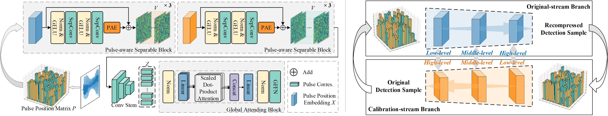

#  Separable Convolution Network with Dual-stream Pyramid Enhanced Strategy for Speech Steganalysis
Code for TIFS 2023 paper:

Separable Convolution Network with Dual-stream Pyramid Enhanced Strategy for Speech Steganalysis

Yiqin Qiu<sup>1</sup>, Hui Tian<sup>2,*</sup>, Haizhou Li<sup>3</sup>, Chin-Chen Chang<sup>4</sup>, Athanasios V. Vasilakos<sup>5</sup>



- [Separable Convolution Network with Dual-stream Pyramid Enhanced Strategy for Speech Steganalysis](#separable-convolution-network-with-dual-stream-pyramid-enhanced-strategy-for-speech-steganalysis)
  - [🏁 Quick Start](#-quick-start)
    - [⚙️ Installation Dependencies:](#️-installation-dependencies)
    - [📥 Download Model Weights:](#-download-model-weights)
    - [📩 Download Dataset:](#-download-dataset)
    - [💻 Starting inference](#-starting-inference)
  - [📚 License](#-license)
  - [😊 Citation](#-citation)


## 🏁 Quick Start

### ⚙️ Installation Dependencies:

1. Installing anaconda and python (our version == 3.8.10).

2. Creating the new environment and install the requirements.

   ```
   conda create -n SepSteNet python=3.8
   
   conda activate SepSteNet
   
   pip install -r requirements.txt
   ```

------

### 📥 Download Model Weights:

Downloading the weights of trained models and place them into `model_weights/`.

There are two option links to download: [GoogleDrive](https://drive.google.com/file/d/1nHUFkQneQuRT1W0q1mKkT9aqxdx8Qjki/view?usp=sharing) and BaiduNetDisk(TODO).

```
${SepSteNetwithDPES}
|-- dataset
|-- model_weights        <-- the downloaded weights of trained models
	|-- SepSteNet
	|-- SepSteNet_with_DPES
|-- model.py
|-- train.py
|-- train_with_DPES.py
|-- utils.py
|-- other python codes, LICENSE, and README files
```

------

### 📩 Download Dataset:

We have extracted pulse positions of each sample of dataset and stored them to .npy files, in which each array is a triplet tuple: (original sample, calibrated sample, label).

The naming convention is: `data_{method}_{sample length}_{embedding rate}_train/val/test.npy`.

Downloading them and place them into `dataset/`.

```
${SepSteNetwithDPES}
|-- dataset              <-- the downloaded dataset
|-- model_weights
	|-- SepSteNet
	|-- SepSteNet_with_DPES
|-- model.py
|-- train.py
|-- train_with_DPES.py
|-- utils.py
|-- other python codes, LICENSE, and README files
```

There are two option links to download: [GoogleDrive](https://drive.google.com/file/d/14n9T5BVYC7f_8QUVNXB0m_hh-iutfQQg/view?usp=sharing), [Kaggle Repo](https://www.kaggle.com/datasets/barryxxz/sepstenetwithdpes), and BaiduNetDisk(TODO).

------

### 💻 Starting inference

For example, if you want to inference on samples of 1.0s embedded by Geiser’s method at the unknow embedding rate:

```
python ./train.py --length 1.0 --em_rate RAND --method Geiser --train Flase -- test True
```

```
python ./train_with_DPES.py --length 1.0 --em_rate RAND --method Geiser --train Flase -- test True
```

Or if you want to train the model, please set `–train` to `True`.

## 📚 License

This project is released under the MIT license. See [LICENSE](https://github.com/BarryxxZ/SepSteNetwithDPES/blob/main/LICENSE) for details.

## 😊 Citation

If you find the code and dataset useful in your research, please consider citing our paper.
